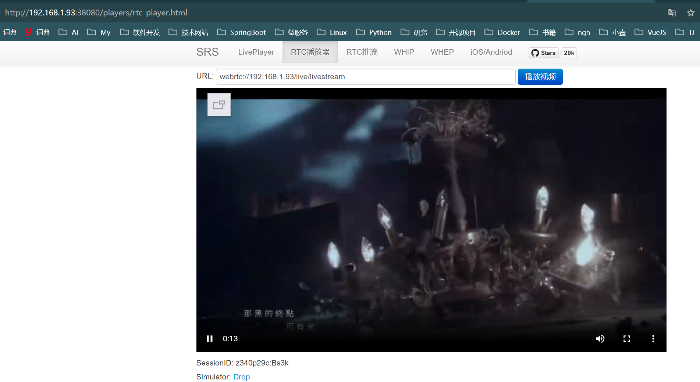
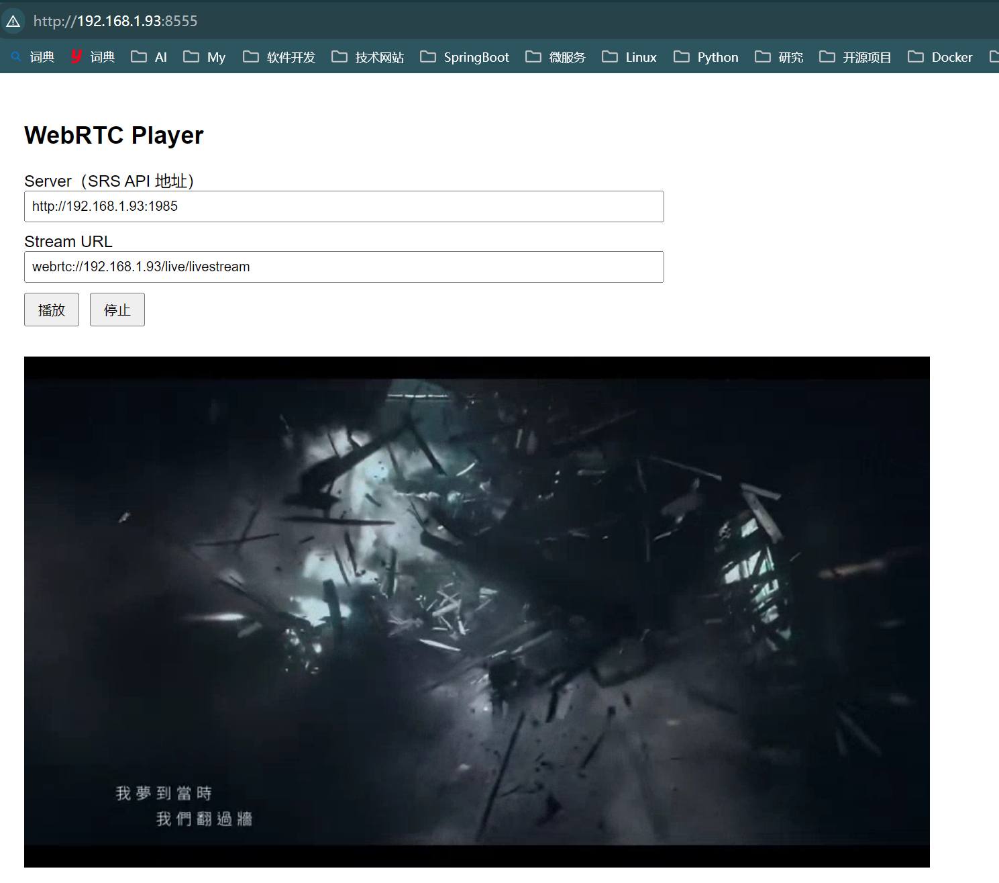

# WebRTC 流媒体实验环境


## 项目简介


本项目用于快速搭建一个完整的 WebRTC 流媒体实验环境，包含以下能力：


- **FFmpeg 循环推送本地 MP4 文件**
- **SRS 提供 RTMP / WebRTC 流媒体服务**
- **浏览器通过 WebRTC 播放视频流**
- **Docker Compose 一键启动整套服务**


适用于：


- WebRTC 播放器开发测试
- 流媒体协议学习
- 低延迟视频实验
- 视频监控类项目原型验证


## 系统架构


```text
本地视频文件（MP4）
        ↓
FFmpeg（循环推流）
        ↓ RTMP
SRS（流媒体服务器）
        ↓ WebRTC
浏览器播放器
```

## 项目目录结构


```text
├── docker-compose.yml
├── nginx
│   └── default.conf
├── video
│   └── cmzw.mp4
└── web
    └── webrtc_play.html
```


## 环境要求


- Docker 20+
- Docker Compose 2+
- Linux / Windows / macOS
- 浏览器（推荐 Chrome）


## 快速开始


### 1. 修改配置


编辑 `docker-compose.yml`：


```yaml
environment:
  CANDIDATE: 192.168.1.93
```


将 `192.168.1.93` 修改为你的服务器真实 IP 地址。


### 2. 准备视频文件


将本地视频文件放到宿主机目录：


```bash
/video/cmzw.mp4
```

### 3. 启动服务

```bash
docker-compose up -d
```


## 浏览器播放测试


* webrtc_play播放器地址：http://192.168.1.93:8555/
* srs控制台：http://192.168.1.93:38080/
* srs自带播放器：http://192.168.1.93:38080/players/rtc_player.html


## 效果展示

srs自带播放器效果



自己写的一个webrtc播放器播放效果


